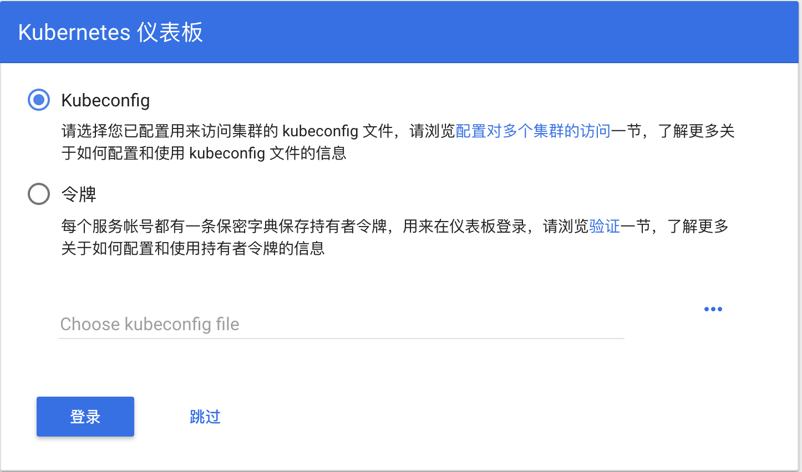
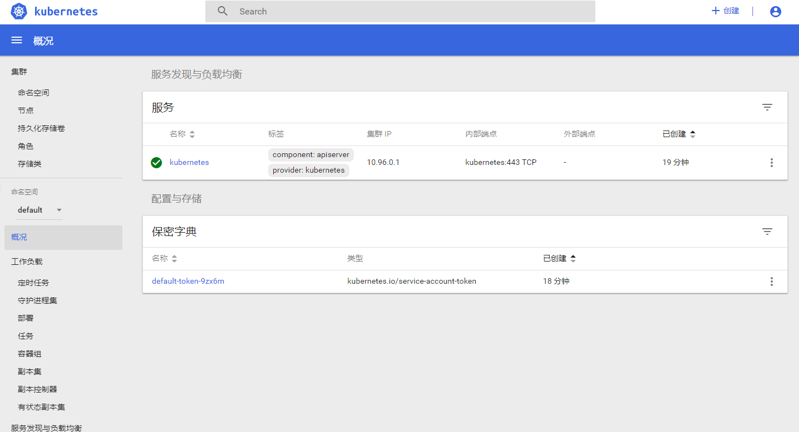

* 配置 Kubernetes

可选操作: 切换Kubernetes运行上下文至 docker-for-desktop


```shell
kubectl config use-context docker-for-desktop
```

验证 Kubernetes 集群状态

```shell
kubectl cluster-info
kubectl get nodes
```

部署 Kubernetes dashboard

```shell
kubectl apply -f https://raw.githubusercontent.com/kubernetes/dashboard/v1.10.1/src/deploy/recommended/kubernetes-dashboard.yaml
```

或

```shell
kubectl create -f kubernetes-dashboard.yaml
```

开启 API Server 访问代理

```shell
kubectl proxy
```

通过如下 URL 访问 Kubernetes dashboard

http://localhost:8001/api/v1/namespaces/kube-system/services/https:kubernetes-dashboard:/proxy/#!/overview?namespace=default

### 配置 kubeconfig (可跳过)


对于Mac环境

```shell
$ TOKEN=$(kubectl -n kube-system describe secret default| awk '$1=="token:"{print $2}')
kubectl config set-credentials docker-for-desktop --token="${TOKEN}"
```

对于Windows环境

```shell
$TOKEN=((kubectl -n kube-system describe secret default | Select-String "token:") -split " +")[1]
kubectl config set-credentials docker-for-desktop --token="${TOKEN}"
```

#### 登录dashboard的时候选择 kubeconfig 文件



选择 kubeconfig 文件,路径如下：

```
Mac: $HOME/.kube/config
Win: %UserProfile%\.kube\config
```

点击登陆，进入Kubernetes Dashboard
