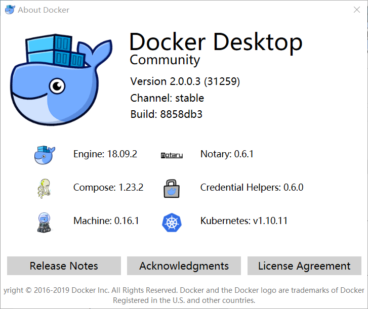
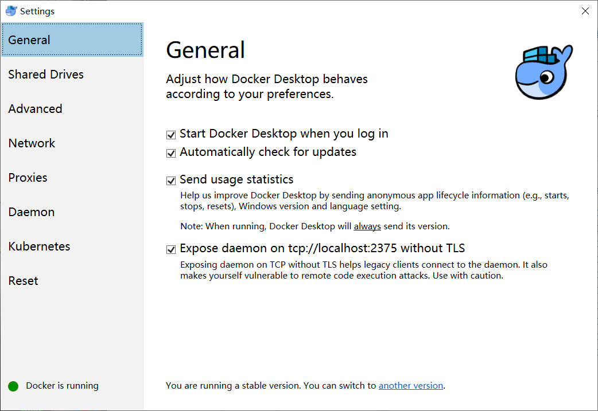
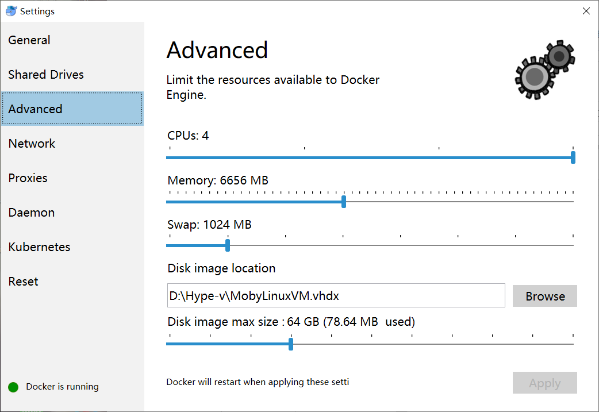
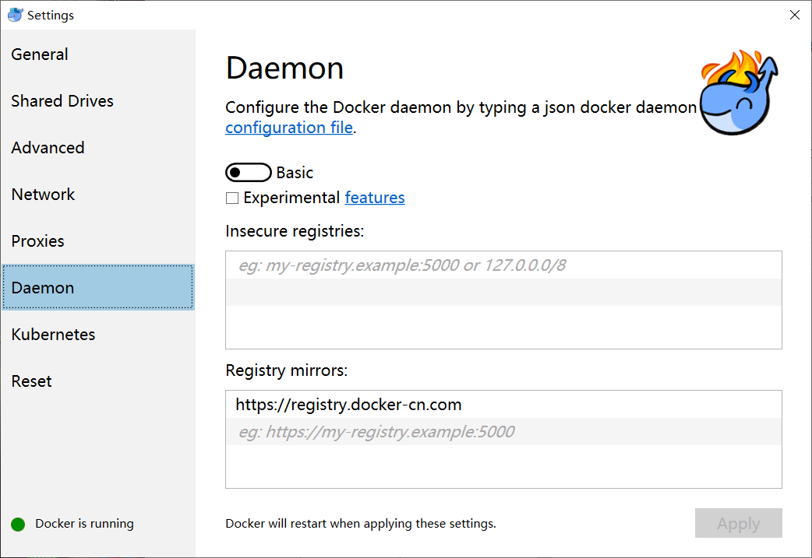
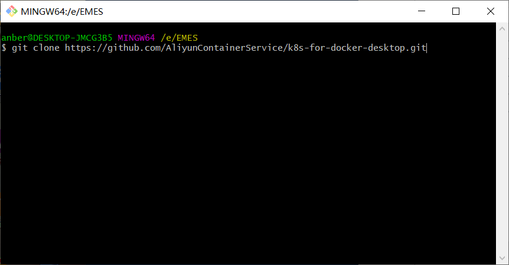
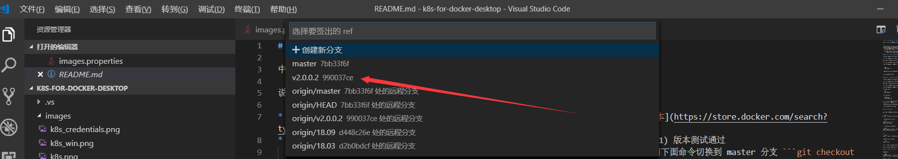
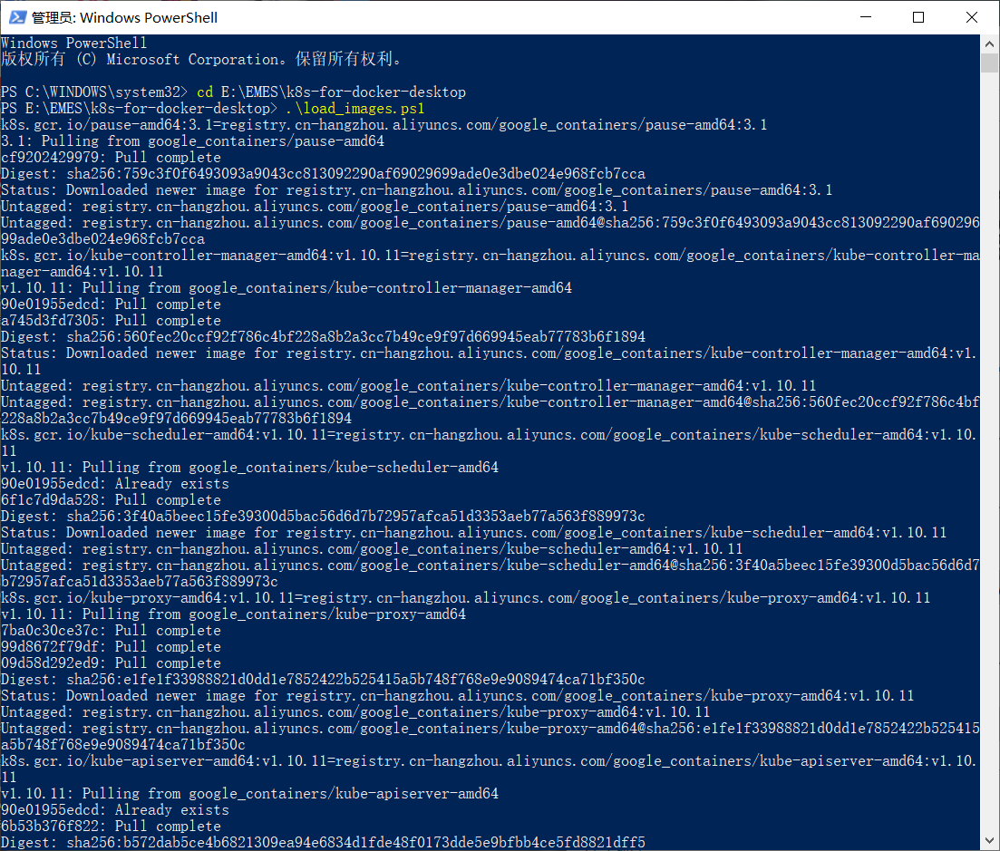
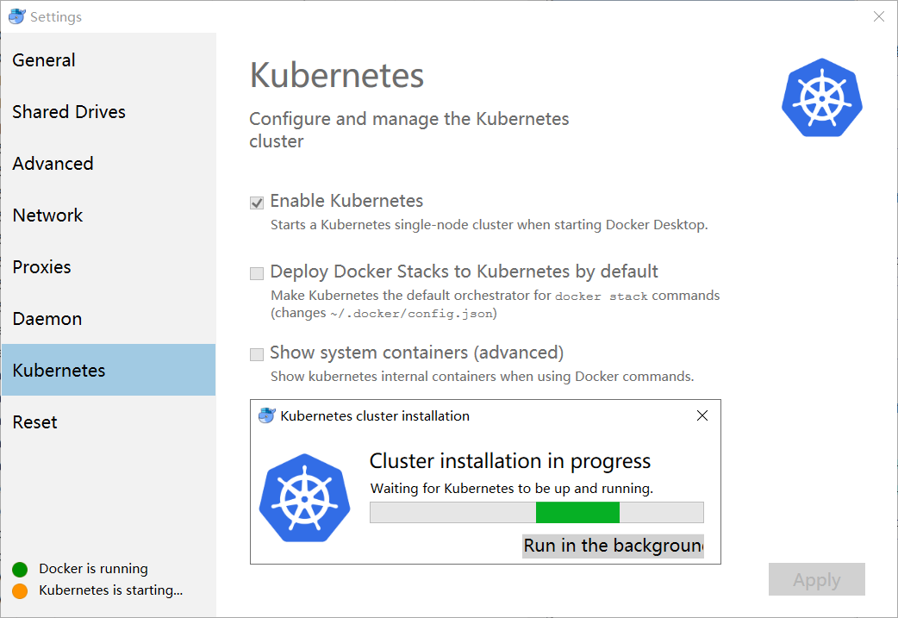
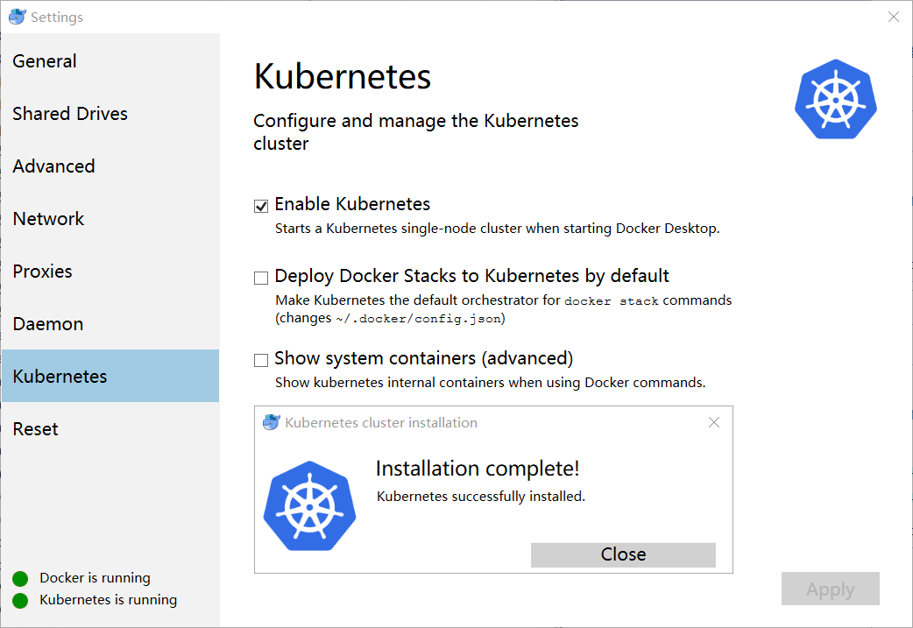

* 目前我们使用 2.0.0.3,需安装  Docker for Mac或者Docker for Windows，如果没有请下载[下载 Docker CE最新版本](https://store.docker.com/search?type=edition&offering=community)
    * 
* 适当调整资源限制
    * 
    * 

* 为 Docker daemon 配置 Docker Hub 的中国官方镜像加速 ```https://registry.docker-cn.com```
    * 

* 预先从阿里云Docker镜像服务下载 Kubernetes 所需要的镜像, 可以通过修改 ```images.properties``` 文件加载你自己需要的镜像
    * clone 阿里云配置好的仓储
    ```bash
    git clone https://github.com/AliyunContainerService/k8s-for-docker-desktop.git
    ```
    * 使用vs code打开文件夹k8s-for-docker-desktop，切换到v2.0.0.2分支
      * 
      * 

    使用 Bash shell

    ```bash
    ./load_images.sh
    ```
    使用 PowerShell
    说明: 如果因为安全策略无法执行 PowerShell 脚本，请在 “以管理员身份运行” 的 PowerShell 中执行 ```Set-ExecutionPolicy RemoteSigned``` 命令。 

    ```powershell
    .\load_images.ps1
    ```
     * 

* 配置kube环境 
说明：.kube 不一定会自己建立文件夹，手工建立时：右键新建文件夹-命名 .kube. 【主要:文件名前后都有"."】
```powershell
 [Environment]::SetEnvironmentVariable("KUBECONFIG", $HOME + "\.kube\config", [EnvironmentVariableTarget]::Machine)
```
* 设置防火墙，防火墙-高级设置-入站规则-新建规则-规则类型 程序-路径 C:\Program Files\Docker\Docker\resources\vpnkit.exe-允许连接-域、专业、公用-名称 vpnkit - 完成；出站规则-新建规则-规则类型 程序-路径 C:\Program Files\Docker\Docker\resources\vpnkit.exe-允许连接-域、专业、公用-名称 vpnkit - 完成；

* 启用Kubernetes
    * 
    * 
